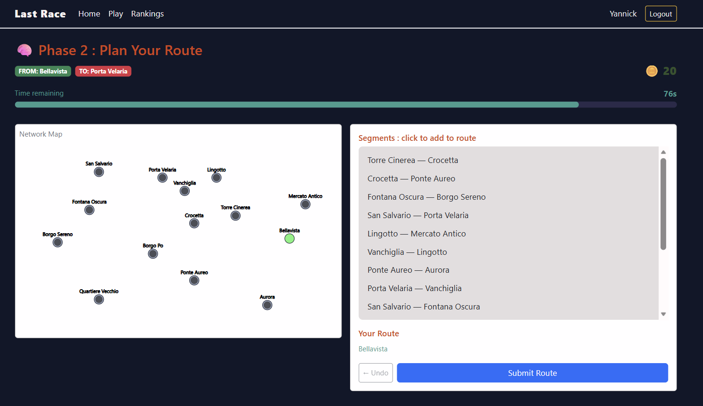

# Exam #1: "Last Race"
## Student: s323313 TSAGUE NGAHOU Yannick 

## React Client Application Routes

- Route `/`: Home page explaining rules of the game for any user authenticated or not.
- Route `/login`: Login page presenting the login form.
- Route `/game`: Game page accessible only for authenticated users. It presents the network map and used as UI during the game.
- Route `/rankings`: Ranking page displaying the ranking table of games done by differents authorized users.

## API Server

- POST `/api/sessions`
  - Parameters : {username, password}, Content-Type: application/json
  - Response : id, username
  - Fonction : Login
- DELETE `/api/sessions/current`
  - Parameters : Null
  - Response : message
  - Fonction : Logout
- GET `/api/something/current`
  - Parameters : Null
  - Response : error or id, username
  - Fonction : Get current user
- GET `/api/network`
  - Parameters : Null
  - Response : The set of Lines(id, name), Stations(id, name, IsInterchange), and Connections(lineId, stationId, position, lineName, stationName)
  - Fonction : Get the entire network
- GET `/api/segments`
  - Parameters : Null
  - Response : the set of segments(station_a_id, station_a_name, station_b_id,station_b_name)
  - Fonction : Returns all unique, randomized adjacent segments for Planning phase
- POST `/api/games/start`
  - Parameters : Null
  - Response : startStation(id, name, isInterchange), endStation(id, name, isInterchange)
  - Fonction : Resolves matching origin/target stations separated by minimum distance >= 3.
- POST `/api/games/submit`
  - Parameters : route, startStationId, endStationId; Content-Type: application/json
  - Response : valid(boolean), score(finalAccumulatedScore), steps(processStepsLog)
  - Fonction : Runs custom path validations and returns simulation steps
- GET `/api/rankings`
  - Parameters : Null
  - Response : generalLeaderboard
  - Fonction : Get the ranking board

## Database Tables

- Table `users` - contains registered users (Yannick, Silvia ...)
- Table `stations` - contains stations (Vanchiglia, San Salvario...)
- Table `lines` - contains lines (red, green, yellow, blue)
- Table `connections` - contains connections (1, 1, 1, blue, San Salvario)
- Table `events` - events with corresponding coins numbers
- Table `games` - games played by users

## Main React Components & Pages

- `HomePage` (in `../pages/homePage.jsx`): Present the game's rules
- `GamePage` (in `../pages/trainPage.jsx`): Game handler. Handle the different steps of the game : Setup, Planning, Execution, Result
- `RankingPage`(in `../pages/rankingPage.jsx`): Display the ranking board
- `NetworkMap`(in `../components/networkMap.jsx`): Handle Map design, create a set conatining unique pairs keys to identy segments
- `Timer`(in `../components/timer.jsx`): Handle timeout for any game

## Screenshot

## Users Credentials

- username : Yannick, password : ynnck 
- username : Silvia, password : slv 

## Use of AI Tools
I used AI (Gemini) for 3 main purposes :

- Write somes functions: main functions usefull to handle timeouts, coins calutions, route requirements, password encryption on database.
- Css design : AI is very efficient and creative in finding some icons on react libraries, and implement classnames, card.
- Debug some errors.  I first used console.log() in different steps of the code to locate bugs and some of the times, i asked for explanation of some bugs to AI.
